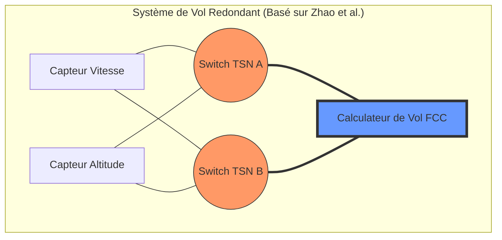
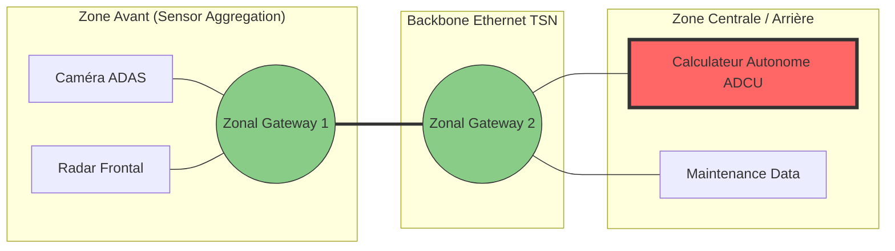

# ns-3 Development Environment: TSN Simulation & Setup

This document outlines the setup process and initial steps for working with **ns-3.47** (ns-allinone). The environment is specifically optimized for **Time-Sensitive Networking (TSN)** research on macOS (Apple Silicon).

## Table of Contents

  - [Overview](overview)
  - [The Build Challenge](the-build-challenge)
  - [System Requirements & Dependencies](system-requirements-&-dependencies)
  - [The Configuration Phase](the-configuration-phase)
  - [Building & Module Optimization](building-&-module-optimization)
  - [Initial Verification & Testing](initial-verification-&-testing)

-----

## Overview

**ns-3** is a discrete-event network simulator primarily written in **C++**. While Python bindings are available, most high-performance research scenarios particularly those requiring the timing precision of TSN—are developed in C++.

Some reminds of [C++ Language Tutorial](https://cplusplus.com/doc/tutorial/) before diving into the ns-3 API.

## The Build Challenge

Setting up this environment required a significant "battle" with compilers and linkers on the ARM64 architecture. While `g++-13` or `g++-15` are often standard, they frequently clash with the macOS linker (`ld`) as I used homebrew to use those compilers.

To achieve stability, we utilize **Clang++-17** combined with **`libc++`** (the LLVM C++ standard library). This combination bypasses the symbol errors encountered with the GNU toolchain on Apple Silicon.

## System Requirements & Dependencies

Before configuring ns-3, ensure you have the **GNU Scientific Library (GSL)** installed (via Homebrew: `brew install gsl`). GSL is critical for modeling jitter, delay, and other stochastic processes in TSN.

Refer to chapters 1.3 and 1.4 of the [Official ns-3 Tutorial](https://www.nsnam.org/docs/release/3.47/tutorial/ns-3-tutorial.pdf) for foundational installation steps.


## The Configuration Phase

The `./ns3 configure` step is the most critical part of the process. Its purpose is to:

1.  **Check Dependencies**: Verify that the required compilers and libraries (like GSL) are present.
2.  **Generate the Build Tree**: Create the instructions for the `Ninja` or `Make` build systems.
3.  **Define Scope**: Enable or disable specific features (examples, tests, or specific modules).

### Optimized "TSN Focus" Configuration

To significantly reduce compilation time (from 2600+ files to \~700), we enable only the modules necessary for TSN research. This excludes heavy, unrelated modules like LTE or WiFi.

```bash
./ns3 clean

# Configure using Clang with libc++ and selective TSN modules
./ns3 configure --build-profile=debug --enable-examples --enable-tests -- \
  -DCMAKE_CXX_COMPILER=clang++ \
  -DCMAKE_C_COMPILER=clang \
  -DNS3_LLD=OFF \
  -DNS3_ENABLED_MODULES="core;network;internet;bridge;traffic-control;point-to-point;csma;applications"

./ns3 build
```

**Required TSN Modules:**

  * `bridge`: For IEEE 802.1Q switch simulation.
  * `traffic-control`: For implementing Time-Aware Shapers (TAS).
  * `csma`: For standard Ethernet-like wired links.

-----

## Initial Verification & Testing

Once the build is complete, you should perform two primary tests to ensure the engine and the L2 bridging logic are operational.

### 1\. Basic Sanity Check

Run the "Hello Simulator" to verify that the discrete-event scheduler is working correctly.

```bash
./ns3 run hello-simulator
```

### 2\. Functional L2 Bridging (Verbose Mode)

The `csma-bridge` example tests the interaction between nodes and a switch. To truly understand the packet flow, it is best to run this in **verbose mode** using the `NS_LOG` variable. This allows you to monitor the learning bridge and packet forwarding in real-time.

```bash
# High-level log for Bridge and CSMA interaction
NS_LOG="BridgeNetDevice:CsmaNetDevice" ./ns3 run csma-bridge
```
## Two simulation in ns-3



