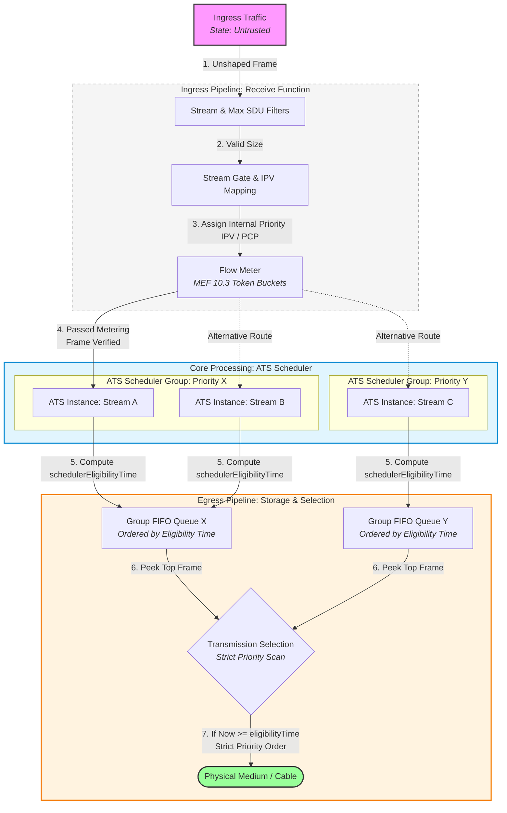

# Software architecture of the Scheduler

The main goal of this file is to use what we learned in the [IEEE802.1Qcr amendment](https://ieeexplore.ieee.org/document/9253013) and summarized in the *02-ats-amendments.md* document which is in the same folder as this one. 

First we will describe the whole pipeline that a frame will go in with the ATS architecture configuration. Then we will describe in details each process mainly with UML diagram.

## Table of contents

- [Software architecture of the Scheduler](#software-architecture-of-the-scheduler)
  - [Table of contents](#table-of-contents)
  - [ATS Pipeline](#ats-pipeline)

## ATS Pipeline

Below is the conceptual pipeline a frame goes through upon arrival at the bridge.

