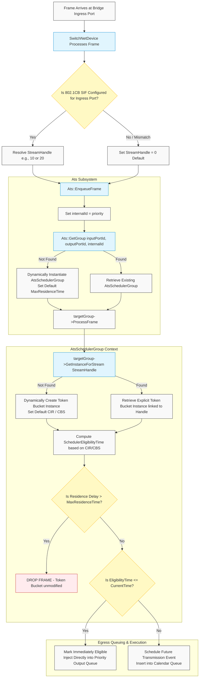
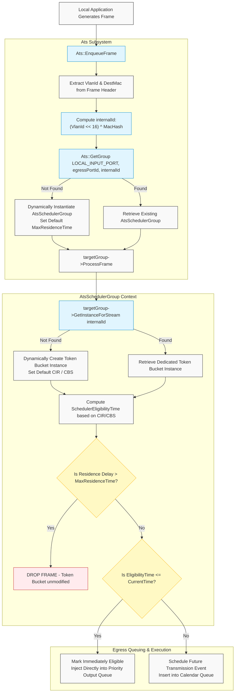

# Software architecture of the Scheduler

The main goal of this file is to use what we learned in the [IEEE802.1Qcr amendment](https://ieeexplore.ieee.org/document/9253013) and summarized in the *02-ats-amendments.md* document which is in the same folder as this one.

We discuss how the ATS is implemented differently depending on the node's role: **Bridges** (Ingress Shaping via `Receive` coupled with IEEE 802.1CB Identification) and **End-Stations** (Egress Shaping via `SendFrom`).

## Table of contents

- [Software architecture of the Scheduler](#software-architecture-of-the-scheduler)
  - [Table of contents](#table-of-contents)
  - [ATS for Bridges](#ats-for-bridges)
    - [Group and Instance Identification](#group-and-instance-identification)
    - [Frame Processing \& Lifecycle Diagram for bridges](#frame-processing--lifecycle-diagram-for-bridges)
    - [Unified Bridge API Functions](#unified-bridge-api-functions)
  - [ATS for End-Stations](#ats-for-end-stations)
    - [Group and Instance Identification](#group-and-instance-identification-1)
    - [Frame Processing \& Lifecycle Diagram for End-Stations](#frame-processing--lifecycle-diagram-for-end-stations)
  - [Unified End-Station API Functions](#unified-end-station-api-functions)

## ATS for Bridges

When a frame arrives at the ingress port of a bridge, it is processed sequentially before being routed to an output queue. The boolean variable `m_atsEnabled` controls this behavior.

### Group and Instance Identification

1. **The ATS Group (`AtsSchedulerGroup`)**: It isolates traffic based on its physical routing path through the switch and its class of service (Per-Port-Per-Priority). A group is uniquely identified by the following triplet:

$$Group\_ID = (Input\_Port, Output\_Port, Output\_Queue)$$

2. **The ATS Instance (Individual Shaper)**: Inside a single bridge group, traffic is divided into token bucket sub-instances mapping directly to a standard TSN Stream Identification Function (IEEE 802.1CB) handle:

$$Instance\_ID = StreamHandle$$

> **Dynamic Allocation & Aggregation**: If no configuration is pre-provisioned or if the Switch fails to resolve a custom stream handle via its SIF tables (e.g., mismatched ingress interface configuration), the ATS subsystem automatically falls back to a dynamic default instance (`Stream ID: 0`) using defaults (`CBS = 16384 bytes`, `CIR = 10 Mbps`, and `MaxResidenceTime = 1s`). During simulation setup, you can pre-create a bridge instance and call `BindStreamToInstance(streamHandle, instanceId)` to explicitly map a resolved 802.1CB identifier to a dedicated bandwidth envelope.

### Frame Processing & Lifecycle Diagram for bridges

The following Mermaid diagram traces the precise execution flow of a forwarded frame inside the Bridge ATS architecture, spanning from ingress arrival down to execution scheduling.

### Unified Bridge API Functions

To safely interact with this architecture without manipulating raw map indices or magic hash tokens, use the following core methods:

* **Group Retrieval**: `Ptr<AtsSchedulerGroup> Ats::GetGroupForBridge(Ptr<TsnNetDevice> ingressDevice, Ptr<TsnNetDevice> egressDevice, uint8_t priority);`
*Extracts interface indices directly from device pointers to prevent indexing mismatches.*
* **Instance Provisioning**: `uint32_t CreateAtsInstance(DataRate cir, uint32_t cbs);`
*Allocates a customized shaping rate inside a specific group.*
* **Stream Binding (IEEE 802.1CB)**: `bool BindStreamToInstance(uint32_t streamHandle, uint32_t instanceId);`
*Binds a recognized 802.1CB `streamHandle` directly to an explicit token bucket instance to enforce shared or isolated shaping.*
* **Priority Activation Control (ATS Bypass)**: 
  * `void Ats::SetPriorityActivation(uint8_t priority, bool activated);`
    *Enables (`true`) or disables (`false`) ATS shaping for a specific Priority Code Point (PCP). By default, all priorities are initialized to `false`, allowing specified traffic classes to bypass the ATS scheduler entirely and be queued directly.*
  * `bool Ats::IsPriorityActivated(uint8_t priority) const;`
    *Helper method used during frame enqueueing to verify if the frame's PCP is actively shaped by the ATS subsystem.*
---

## ATS for End-Stations

For an End-Station, we do not want to introduce latency upon reception. Instead, we shape the traffic **at the emission source** right before transmission, controlled by the boolean `m_atsEnabled`.

### Group and Instance Identification

Unlike bridges which group traffic by input-output port pairs and rely on 802.1CB classification, an End-Station maps shaping mechanisms directly to network stream profiles using L2 header metrics. By default, the mapping adheres to a strict one-to-one relationship:

$$\text{One Stream} = \text{One Group} = \text{One Instance}$$

Thus, for each unique **StreamKey** $(DestMac, VlanId)$, a unique dedicated scheduler group is allocated, housing a single corresponding token bucket instance inside it.

### Frame Processing & Lifecycle Diagram for End-Stations

The main architectural shift here is how the `internalId` is derived. Because there is no physical ingress port (`inputPortId` defaults to `Ats::LOCAL_INPUT_PORT`), the unique internal index is computed by shifting the `VlanId` and XORing it with a 32-bit hash generated from the lower bytes of the destination MAC address.

## Unified End-Station API Functions

To safely interact with this architecture without manipulating raw map indices or magic hash tokens, use the following core methods:

* **Group Retrieval**: `Ptr<AtsSchedulerGroup> Ats::GetGroupForEndStation(Mac48Address destMac, uint16_t vlanId, Ptr<TsnNetDevice> egressDevice);`
*Abstracts the internal `LOCAL_INPUT_PORT` parameter, automatically computes the MAC/VLAN XOR hash identity, and queries the standard ns-3 interface indices safely.*
* **Instance Provisioning**: `uint32_t CreateAtsInstance(DataRate cir, uint32_t cbs);`
*Allocates a customized shaping rate inside the specific stream group.*
* **Stream Aggregation (End-Station)**: `void BindStreamToInstanceES(Mac48Address destMac, uint16_t vlanId, uint32_t instanceId);`
*Forces multiple local application profiles onto a single shared End-Station token bucket instance based on their target L2 identification context.*
* **Priority Activation Control (ATS Bypass)**: 
  * `void Ats::SetPriorityActivation(uint8_t priority, bool activated);`
    *Enables (`true`) or disables (`false`) ATS shaping for a specific Priority Code Point (PCP). By default, all priorities are initialized to `false`, allowing specified traffic classes to bypass the ATS scheduler entirely and be queued directly.*
  * `bool Ats::IsPriorityActivated(uint8_t priority) const;`
    *Helper method used during frame enqueueing to verify if the frame's PCP is actively shaped by the ATS subsystem.*