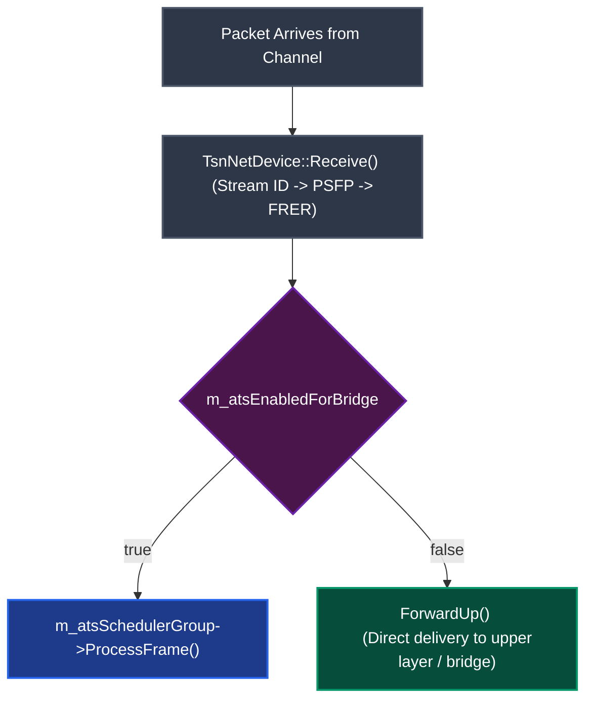
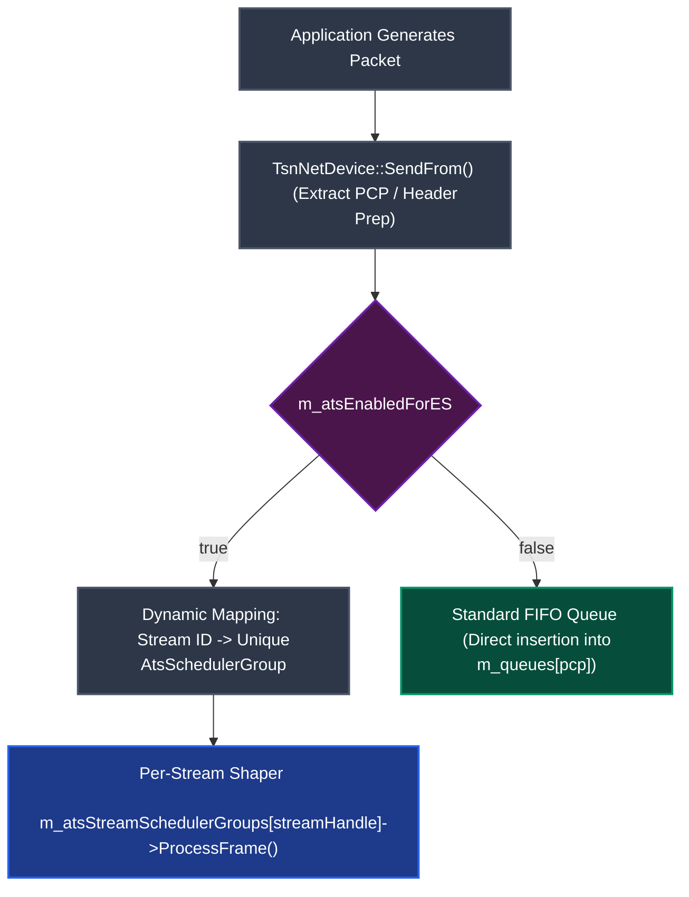
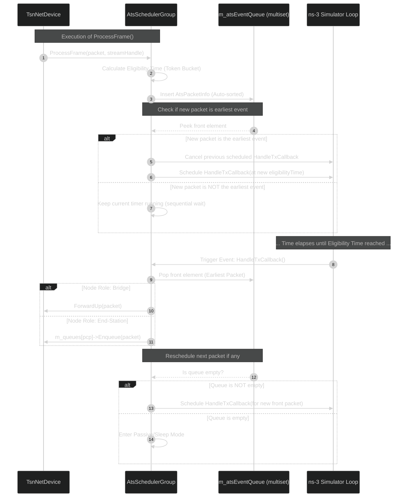

# Software architecture of the Scheduler

The main goal of this file is to use what we learned in the [IEEE802.1Qcr amendment](https://ieeexplore.ieee.org/document/9253013) and summarized in the *02-ats-amendments.md* document which is in the same folder as this one.

We discuss how the ATS is implemented differently depending on the node's role: **Bridges** (Ingress Shaping via `Receive`) and **End-Stations** (Egress Shaping via `SendFrom`).

## Table of contents

* [ATS for Bridges (Ingress Shaping)](https://www.google.com/search?q=%23ats-for-bridges-ingress-shaping)
* [ATS for End-Stations (Egress Shaping & Per-Stream Isolation)](https://www.google.com/search?q=%23ats-for-end-stations-egress-shaping--per-stream-isolation)
* [ATS Internal Processing (ProcessFrame & Scheduler)](https://www.google.com/search?q=%23ats-internal-processing-processframe--scheduler)

---

## ATS for Bridges (Ingress Shaping)

When a frame arrives at the ingress port of a bridge, it is processed sequentially inside `TsnNetDevice::Receive` before being routed to an output port. The boolean `m_atsEnabledForBridge` controls this behavior.



---

## ATS for End-Stations (Egress Shaping & Per-Stream Isolation)

For an End-Station, we do not want to introduce latency upon reception. Instead, we shape the traffic **at the emission source** inside the `TsnNetDevice::SendFrom` function, controlled by the boolean `m_atsEnabledForES`.

Furthermore, to guarantee Strict Isolation at the end-station level, the architecture enforces a **1 Stream = 1 Instance = 1 Group** mapping. Every unique application stream gets its own independent token bucket and shaping queue.



---

## ATS Internal Processing (ProcessFrame & Scheduler)

Whether triggered by a Bridge (Ingress) or an End-Station (Egress), the core execution of `ProcessFrame()` remains identical, utilizing a time-ordered `std::multiset` and a precise callback scheduling system.

### Sorting Strategy: The Custom Comparator

```cpp
struct AtsPacketInfo
{
    Ptr<Packet> packet;
    Time eligibilityTime;
    uint8_t priority;
    uint32_t streamHandle;
    Time hardwareLatency;
};

struct AtsPacketComparator
{
    bool operator()(const AtsPacketInfo a, const AtsPacketInfo b) const
    {
        // 1. Earlier eligibility times must be processed first
        if (a.eligibilityTime != b.eligibilityTime)
        {
            return a.eligibilityTime < b.eligibilityTime;
        }
        // 2. Tie-breaker: Higher priority values (PCP) come first
        return a.priority > b.priority;
    }
};

```

### ProcessFrame & Event Scheduling Pipeline

