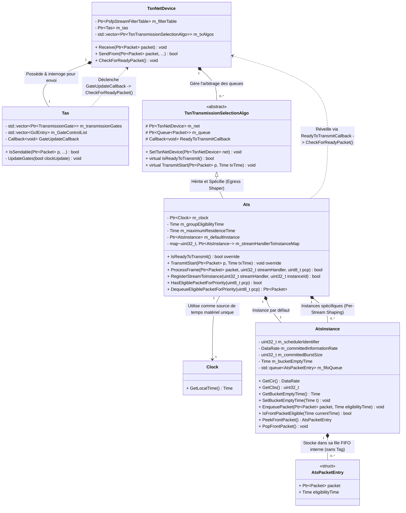

# Software architecture of the Scheduler

The main goal of this file is to use what we learned in the [IEEE802.1Qcr amendment](https://ieeexplore.ieee.org/document/9253013) and summarized in the *02-ats-amendments.md* document which is in the same folder as this one. 

First we will describe the whole pipeline that a frame goes through in the current implementation with two different shapers (*CBS* and *TAS*). Then we will describe how the ATs could be implemented with two different approaches. The first one is the overall functioning, to acknowledge the principle and then the software architecture of it which helps me to think about something modular in case of misunderstanding.

## Table of contents

- [Software architecture of the Scheduler](#software-architecture-of-the-scheduler)
  - [Table of contents](#table-of-contents)
  - [Current Architectural Pipeline](#current-architectural-pipeline)
    - [Pipeline Diagram](#pipeline-diagram)
  - [ATS Implementation](#ats-implementation)
    - [Version 1: Single-Instance Group](#version-1-single-instance-group)
      - [Conceptual diagram](#conceptual-diagram)
    - [Version 2: Per-Stream Multi-Instance Group](#version-2-per-stream-multi-instance-group)
      - [Conceptual diagram](#conceptual-diagram-1)
    - [What does "Ready?" mean?](#what-does-ready-mean)
      - [Conceptual Queuing Models](#conceptual-queuing-models)
        - [Option 1: Per-Instance FIFO](#option-1-per-instance-fifo)
        - [Option 2: Per-Group Sorted Queue (Alternative Architecture)](#option-2-per-group-sorted-queue-alternative-architecture)
  - [UML class](#uml-class)
  

## Current Architectural Pipeline

1. **Ingress (Reception):** When a frame arrives at the **TsnNetDevice**, it enters the **PSFP** (*IEEE 802.1Qci*) pipeline, which currently processes everything except the Stream Gate mechanism. The frame then passes through the **FRER** (*IEEE 802.1CB*) recovery functions and a packet-based classification system.
2. **Egress (Transmission):** When the packet is ready to be forwarded, the **SendFrom** function classifies and maps it to one of the 8 egress priority queues. Inside these queues, traffic shaping and scheduling are handled by shaper modules inheriting from **TransmissionSelectionAlgo**.

### Pipeline Diagram

```text
[ Incoming Frame ] 
       │
       ▼ (Ingress Port)
┌────────────────────────────────────────┐
│ TsnNetDevice::Receive()                │
│  ├── 1. PSFP Pipeline (Filters/Meters) │  <-- Missing: Stream Gate
│  ├── 2. FRER Recovery                  │
│  └── 3. Stream Identification / Tag    │
└────────────────────────────────────────┘
       │
       ▼ (Bridging / Higher Layers)
┌────────────────────────────────────────┐
│ TsnNetDevice::SendFrom()               │
│  └── Priority Mapping (PCP 0-7)        │
└────────────────────────────────────────┘
       │
       ▼ (Traffic Class Assignment)
┌────────────────────────────────────────┐
│ 8 Egress Traffic Class Queues          │
│  └── TransmissionSelectionAlgo         │  <-- Shapers (TAS, CBS, etc.)
└────────────────────────────────────────┘
       │
       ▼ (Physical Wire)
[ Transmitted Frame ]

```

## ATS Implementation

In accordance with the current implementation, traffic shapers are embedded directly within the egress (output) queues of a network port. So we will implement ATS at this layer and now we will discuss about ATS **groups** and **instances**.

As decided we map **one ATS Group per Egress Priority Queue**. Within each group, multiple shaping instances can be created dynamically.

### Version 1: Single-Instance Group

To establish a simple and stable baseline, the initial version will constrains each ATS Group to a **single shaping instance**. This will acts as the fallback default configuration. All streams mapped to a given priority traffic class share the same shaper.

#### Conceptual diagram

*All streams mapped to Priority 5 share a single Token Bucket instance.*

```text
[ Egress Port: SendFrom ]
           │
           ▼
┌────────────────── Egress Priority Queue 5 ──────────────────┐
│                                                             │
│  Stream A ──┐                                               │
│             ├──► [ ATS Group 5 ] ──► [ Single Instance ] ───┼─► Ready?
│  Stream B ──┘                           (Token Bucket)      │
│                                                             │
└─────────────────────────────────────────────────────────────┘
                                                                 │
                                                                 ▼
                                                       [ TAS / Gate Control ]

```

### Version 2: Per-Stream Multi-Instance Group

The next iteration will fix this limitation, allowing a single ATS Group to host **multiple independent shaping instances**. The idea is to provide a *per stream shaping*.

#### Conceptual diagram

*Streams mapped to Priority 5 are isolated into dedicated, independent Token Bucket instances.*

```text
[ Egress Port: SendFrom ]
           │
           ▼
┌────────────────── Egress Priority Queue 5 ──────────────────┐
│                                                             │
│               De-mux (StreamHandle)                         │
│                         │                                   │
│                         ├──► [ Instance 1 ] (Stream A) ─────┼─► Ready?
│  Streams A & B ─────────┤      (Token Bucket)               │  
│                         │                                   │
│                         └──► [ Instance 2 ] (Stream B) ─────┼─► Ready?
│                                (Token Bucket)               │
│                                                             │
└─────────────────────────────────────────────────────────────┘
                                                                 │
                                                                 ▼
                                                       [ TAS / Gate Control ]
```

### What does "Ready?" mean?

The core mechanism of **ATS** relies on calculating an *eligibility time* for each frame inside the `ProcessFrame` function. Because frames are subject to this shaping delay, they cannot be pushed directly to the transmission gates upon arrival. Instead, they must be deferred until they become logically "Ready."

To hold frames, two architectural queuing strategies can be considered:

1. **Per-Instance FIFO Queues ($O(1)$ Complexity):** Each shaping instance maintains its own dedicated FIFO queue. Since a frame arriving later for a specific stream can never become eligible *before* an earlier one, the queue remains strictly ordered. A frame is "Ready" when the packet at the head of the instance queue satisfies:

$$\text{EligibilityTime} \le \text{Simulator::Now()}$$


2. **Per-Group Sorted Queue ($O(N)$ Complexity in worst case):** A single, unified queue is shared across the entire ATS Group. Whenever a new frame arrives, the queue must be actively sorted by its eligibility timestamp (and by internal priority as a tie-breaker). The port checks the head of this global queue to retrieve the next "Ready" frame.


#### Conceptual Queuing Models

##### Option 1: Per-Instance FIFO

```text
[ Incoming Frame ] ──► ProcessFrame() ──► Calculate EligibilityTime
                                                │
                                                ▼
         ┌─────────────── ATS Group (Traffic Class Priority 5) ───────────────┐
         │                                                                    │
         │  Instance 1 (Stream A) :  [ Pkt 1: 10ms ] ◄─ [ Pkt 2: 15ms ]       │ ──► Front Eligible? (Ready)
         │                                                                    │
         │  Instance 2 (Stream B) :  [ Pkt 1: 12ms ] ◄─ [ Pkt 2: 14ms ]       │ ──► Front Eligible? (Ready)
         │                                                                    │
         └────────────────────────────────────────────────────────────────────┘
                                                                                │
                                                                                ▼
                                                                     [ TransmitSelection ]
                                                                     (Picks the highest priority 
                                                                      among Ready packets)

```

##### Option 2: Per-Group Sorted Queue (Alternative Architecture)

```text
[ Incoming Frame ] ──► ProcessFrame() ──► Calculate EligibilityTime
                                                │
                                                ▼
         ┌─────────────── ATS Group (Traffic Class Priority 5) ───────────────┐
         │                                                                    │
         │  Single Unified Queue :                                            │
         │  [ Stream A: 10ms ] ◄─ [ Stream B: 12ms ] ◄─ [ Stream A: 15ms ]    │ ──► Head of Queue (Ready)
         │     (Sorted)                                                       │
         └────────────────────────────────────────────────────────────────────┘
                                                                                │
                                                                                ▼
                                                                     [ TransmitSelection ]

```

 ## UML class

