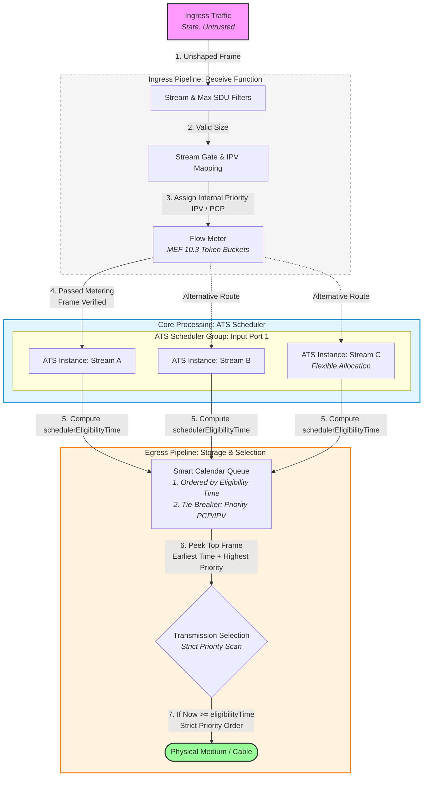
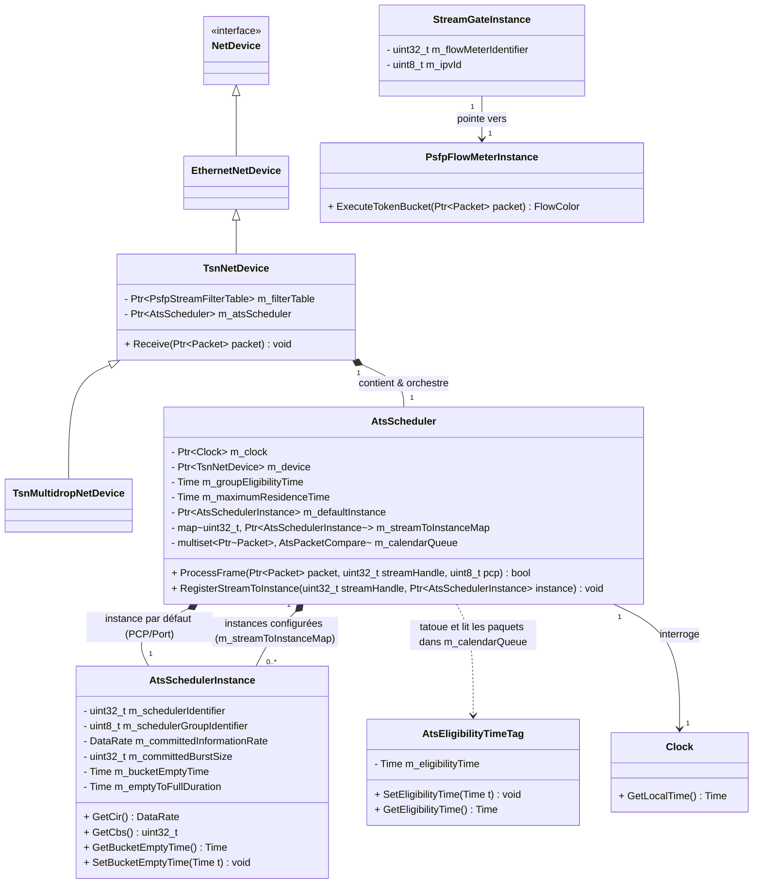

# Software architecture of the Scheduler

The main goal of this file is to use what we learned in the [IEEE802.1Qcr amendment](https://ieeexplore.ieee.org/document/9253013) and summarized in the *02-ats-amendments.md* document which is in the same folder as this one. 

First we will describe the whole pipeline that a frame will go in with the ATS architecture configuration. Then we will describe in details each process mainly with UML diagram.

## Table of contents

- [Software architecture of the Scheduler](#software-architecture-of-the-scheduler)
  - [Table of contents](#table-of-contents)
  - [ATS Pipeline](#ats-pipeline)
  - [What to add in the ingress pipeline](#what-to-add-in-the-ingress-pipeline)
    - [Flow meters attributes](#flow-meters-attributes)
  - [UML class](#uml-class)

## ATS Pipeline

Below is the conceptual pipeline a frame goes through upon arrival at the bridge.

## What to add in the ingress pipeline

Most of the work is already done, so it just need to retrieve everything we need but the main work will be to add the IPV feature which replace the priority in the frame. Of course, we need a boolean like **IpvEnabled** that we will be able to set as an attribute of the gate. Also we can improve the debug process with all the attributes that the amendment talks about (flow meters).

As we are working with **NS3**  we can reshape a bit the **SetGateAndIPV** function. Because we are working with a discrete events simulator, we might think at how the user can close or change the IPV of a gate within core functionalities. Then it would be better to maybe replace the delay period by a simple thing. We can still choose whether the gate is open or not and also the *IPV* value, but we replace the delay by the moment we want to change the state of a gate. 

```cpp
void SetGateAndIPV(StreamGateState state, uint8_t IPV, StartTime)
```

### Flow meters attributes

Most of the flow meters are already here but maybe not everything is at the right place, just to summarize :

 - Flow meters id -> done 
 - CIR (bits/s) -> done
 - CBS (bytes) -> done 
 - EIR (bits/s) -> done 
 - EBS (bytes) -> done 
 - CF (boolean) -> done
 - Color mode (boolean) -> done
 - DropOnYellow (boolean) -> done
 - MarkAllFramesRedEnable (boolean) -> done
 - MarkAllFramesRed (boolean) -> done

 ## UML class 
