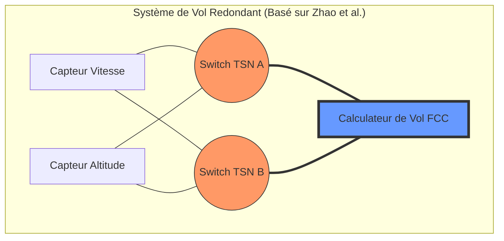
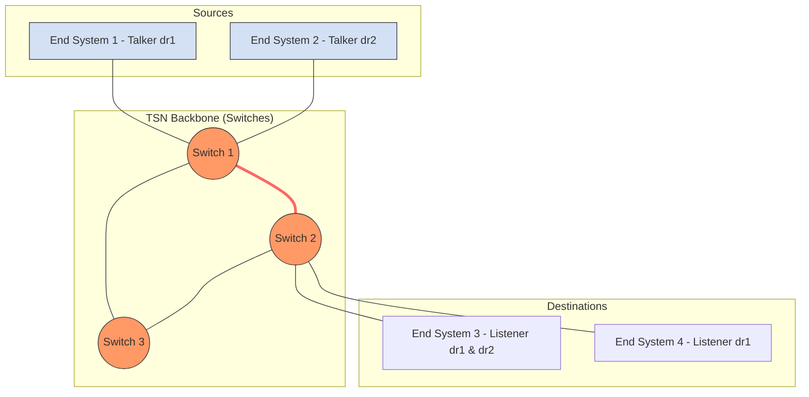

# TSN Test Topologies for Evaluation

This document outlines the network topologies I used to evaluate my Time-Sensitive Networking (TSN) implementations, specifically focusing on transport industry.

---

## Topology 1: Aerospace High-Reliability Redundant Network
**Source:** [IEEE 802.1 TSN Aerospace Webinar (Jabbar, 09/2024)](https://www.ieee802.org/1/files/public/docs2024/webinar-Jabbar-TSN-Aerospace-0924.pdf)

### Description
This topology is modeled after aerospace onboard Ethernet communications requirements, where zero-packet-loss and extreme fault tolerance are mandatory. It implements a **Dual Link / Redundant Transmission** setup. 
* A Talker (source node) is connected to a Listener (destination node) via two completely disjoint network paths (Path A and Path B).
* It utilizes mechanisms akin to **IEEE 802.1CB** (Frame Replication and Elimination for Reliability - FRER). 
* The Talker replicates critical time-sensitive frames and sends them simultaneously over both paths. The Listener (or the final relay switch) identifies duplicates via sequence numbers and eliminates them.

### Purpose and Interest
* **Resilience Testing:** Allows us to observe network behavior and simulate link failures (e.g., bringing down a switch on Path A) to ensure that the stream on Path B continues uninterrupted with zero switchover time.
* **Redundancy Evaluation:** Proves that the implementation can handle hardware faults seamlessly, which is a core requirement for mission-critical TSN deployments.

Voici une deuxième topologie basée directement sur la **Figure 2** de l'article scientifique que vous avez fourni. 

Cette topologie est particulièrement intéressante pour l'évaluation car elle introduit des scénarios de **multi-sauts (multi-hop)** et de **confluence de flux**, ce qui permet de tester l'accumulation de la gigue et le calcul des pires délais (Worst-Case Latency).

---

## Topology 2: Multi-Hop Mixed-Traffic Network
**Source:** [Zhao, L., Pop, P., & Craciunas, S. S. (2018). "Worst-Case Latency Analysis for IEEE 802.1Qbv Time Sensitive Networks Using Network Calculus". *IEEE Access*, vol. [cite_start]6, pp. 41803-41819.](https://ieeexplore.ieee.org/document/8418352) [cite: 2]

---

### Pourquoi cette topologie complète la première :
1.  **Topologie 1 (Aérospatiale) :** Teste la robustesse via la **redondance** (plusieurs chemins physiques).
2.  **Topologie 2 (Zhao et al.) :** Teste la performance temporelle via le **multi-sauts** (un seul chemin critique partagé par plusieurs flux).

[cite_start]L'utilisation de cette source (Zhao et al., 2018) est très solide car elle provient d'une étude publiée dans **IEEE Access** qui fait référence pour l'analyse des délais par le calcul réseau (Network Calculus)[cite: 2, 97].