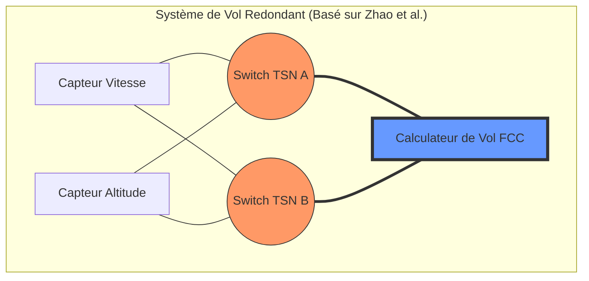
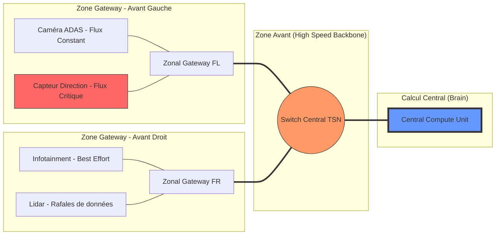

# TSN Test Topologies for Evaluation

This document outlines the network topologies I used to evaluate my Time-Sensitive Networking (TSN) implementations, specifically focusing on transport industry.

---

## Topology 1: Aerospace High-Reliability Redundant Network
**Source:** [IEEE 802.1 TSN Aerospace Webinar (Jabbar, 09/2024)](https://www.ieee802.org/1/files/public/docs2024/webinar-Jabbar-TSN-Aerospace-0924.pdf)

### Description
This topology is modeled after aerospace onboard Ethernet communications requirements, where zero-packet-loss and extreme fault tolerance are mandatory. It implements a **Dual Link / Redundant Transmission** setup. 
* A Talker (source node) is connected to a Listener (destination node) via two completely disjoint network paths (Path A and Path B).
* It utilizes mechanisms akin to **IEEE 802.1CB** (Frame Replication and Elimination for Reliability - FRER). 
* The Talker replicates critical time-sensitive frames and sends them simultaneously over both paths. The Listener (or the final relay switch) identifies duplicates via sequence numbers and eliminates them.

### Purpose and Interest
* **Resilience Testing:** Allows us to observe network behavior and simulate link failures (e.g., bringing down a switch on Path A) to ensure that the stream on Path B continues uninterrupted with zero switchover time.
* **Redundancy Evaluation:** Proves that the implementation can handle hardware faults seamlessly, which is a core requirement for mission-critical TSN deployments.

