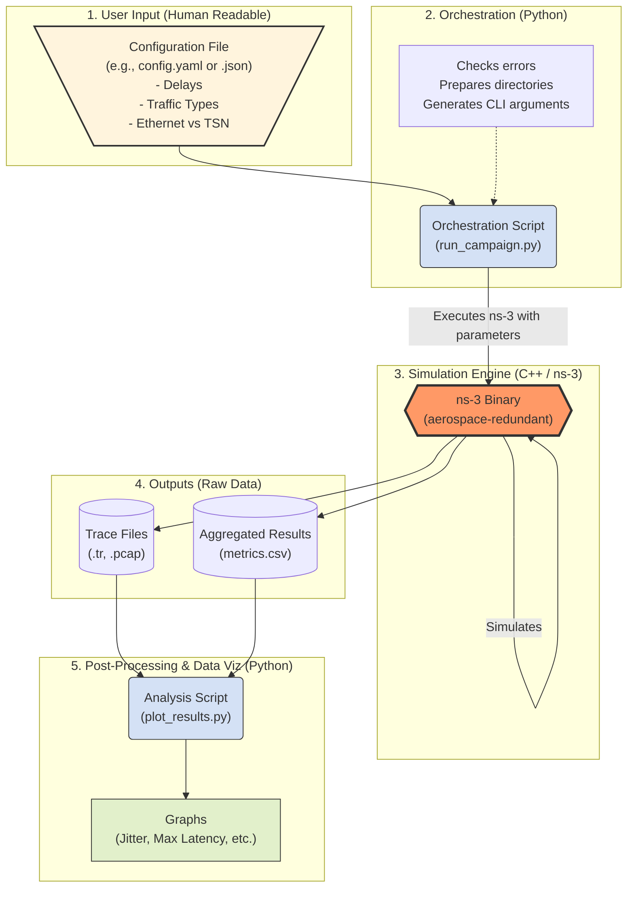

# Simulation Automation Pipeline

This document outlines the perspective architecture of my automated simulation framework. The goal of this pipeline is to separate the simulation configuration from the core C++ engine, allowing for scalable, reproducible, and user-friendly testing campaigns without requiring C++ recompilation for every change.

## Architecture Overview

## Pipeline Workflow

### 1. User Input (`config.json` / `config.yaml`)
A human-readable text file used to define the parameters of the simulation. This allows non-experts to run complex network scenarios by simply adjusting key-value pairs (e.g., switching between `Ethernet` and `TSN`, modifying link delays, or defining traffic criticality).

### 2. Orchestration (`run_campaign.py`)
A Python script acts as the campaign manager. It parses the configuration file, performs sanity checks on the inputs, creates isolated output directories for each run, and translates the settings into Command Line Interface (CLI) arguments to be passed to the ns-3 engine.

### 3. Simulation Engine (`aerospace-redundant.cc`)
The core ns-3 C++ executable. This component is completely agnostic and contains no hardcoded values. It receives its context via CLI arguments, executes the discrete-event simulation, and routes traffic through the defined multi-hop topology.

### 4. Outputs (Raw Data)
The simulation generates raw data files without performing heavy statistical calculations during runtime. Outputs typically include network traces (`.pcap` for packet inspection, `.tr` for ns-3 ASCII traces) and basic metric logs (`.csv`).

### 5. Post-Processing & Data Visualization (`plot_results.py`)
A final Python script processes the raw outputs. Using data science libraries (like `pandas` and `matplotlib`), it calculates complex metrics (e.g., worst-case latency, jitter distribution) and generates graphical plots to evaluate the performance of standard Ethernet versus TSN scheduling.

## Key Benefits
* **Scalability:** Easily run batches of simulations (e.g., 50 variations of cross-traffic delays) unattended.
* **Reproducibility:** Every simulation run is tied to a specific configuration file, making it easy to replicate results for scientific publications.
* **Accessibility:** Team members can evaluate the network architecture without needing to understand ns-3 C++ internals.
